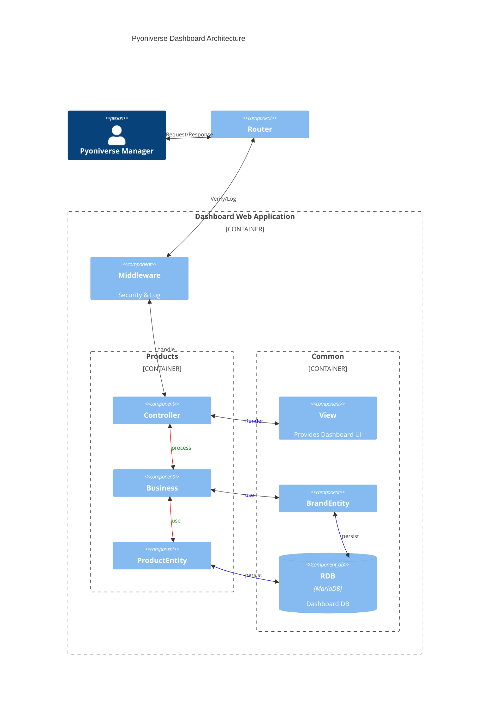

# Architecture
> SOA + Domain 기반 + MVC & Humble Pattern

## 아키텍처 고려사항
### 아키텍처 특성
**보안성**
프로젝트 관리자만 데이터를 수정할 수 있어야 한다.

**사용성**
서비스 사용방법을 익히는데 적은 시간이 들어야 한다.

**신뢰성**
수정 결과는 운영 환경에 반영되고, 이후 데이터가 덮어씌워지지 않는다.

### 아키텍처 결정
- 변경된 데이터는 일단위로 반영된다.
- 서비스는 Full-stack 개발자 1인에 의해 개발된다.

### 설계원칙
- 테스트 코드부터 작성해야 한다.
- Humble 패턴을 사용해야 한다.
- commit 전에 코드 정리 및 테스트케이스를 통과해야 한다.
- 배포는 자동으로 이루어져야 한다.
