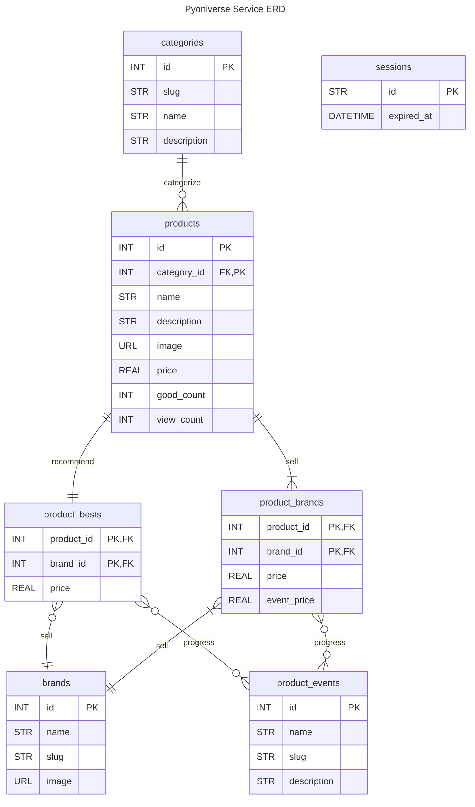

# Entity Relationship Diagram

## Entity Set
**categories**
- 상품 카테고리 정보를 표현하는 객체
- Ex) 우유, 아이스크림 등

**products**
- 상품 정보를 표현하는 객체
- Ex) 바나나우유 등

**product_bests(Week)**
- 상품의 행사 및 일반 가격들 중 가장 낮은 가격을 표현하는 객체

**product_brands(Week)**
- 편의점별 상품 가격 및 행사 가격을 표현하는 객체

**brands**
- 편의점 정보를 표현하는 객체
- Ex) CU, Seven Eleven 등

**product_events**
- 편의점의 상품 행사 정보를 표현하는 객체
- Ex) 1+1, 2+1 등

**events**
- 편의점 행사 정보를 표현하는 객체
- Ex) 11월 할인 행사, 카드 혜택 행사 등

**event_images(Week)**
- 편의점 행사 배너 및 상세 이미지를 표현하는 객체

**event_image_types**
- 편의점 이미지의 종류를 표현하는 객체
- Ex) thumbnail, others

## Relationship
**categories <-- products**
- 1:N Relationship
- 한 상품은 하나의 카테고리에 속하고, 한 카테고리에는 여러 상품이 속할 수 있다.

**products <--> product_bests**
- 1:1 Relationship
- 한 상품은 오직 하나의 최저 가격 정보를 가진다.

**products <-- product_brands**
- 1:N Relationship
- 상품의 편의점별 가격은 해당 상품에 속하고, 한 상품은 여러 편의점에서 구매 가능하다.

**product_bests --> brands**
- N:1 Relationship
- 한 상품의 최저 가격은 오직 하나의 편의점과 연관되고, 편의점은 여러 상품의 최저 가격을 가질 수 있다.

**product_bests -- product_events**
- N:N Relationship
- 한 상품의 최저 가격은 여러 상품 행사와 연관될 수 있고, 상품 행사 정보 역시 여러 상품의 최저 가격과 연관될 수 있다.

**product_brands --> brands**
- N:1 Relationship
- 한 상품이 팔리는 편의점은 여러 편의점과 연관될 수 있고, 편의점은 여러 상품을 팔 수 있다.

**product_brands -- product_events**
- N:N Relationship
- 한 상품은 여러 편의점에서 행사가 진행될 수 있고, 행사는 여러 상품과 연관된다.

**brands <-- events**
- 1:N Relationship
- 한 편의점은 여러 행사를 진행할 수 있고, 행사는 한 편의점에서 진행된다.

**events <-- event_images**
- 1:N Relationship
- 한 행사는 여러 이미지를 가질 수 있고, 이미지는 한 행사에서만 사용된다.

**event_image_types <-- event_images**
- 1:N Relationship
- 한 행사 이미지는 하나의 이미지 타입과 연관된다.
