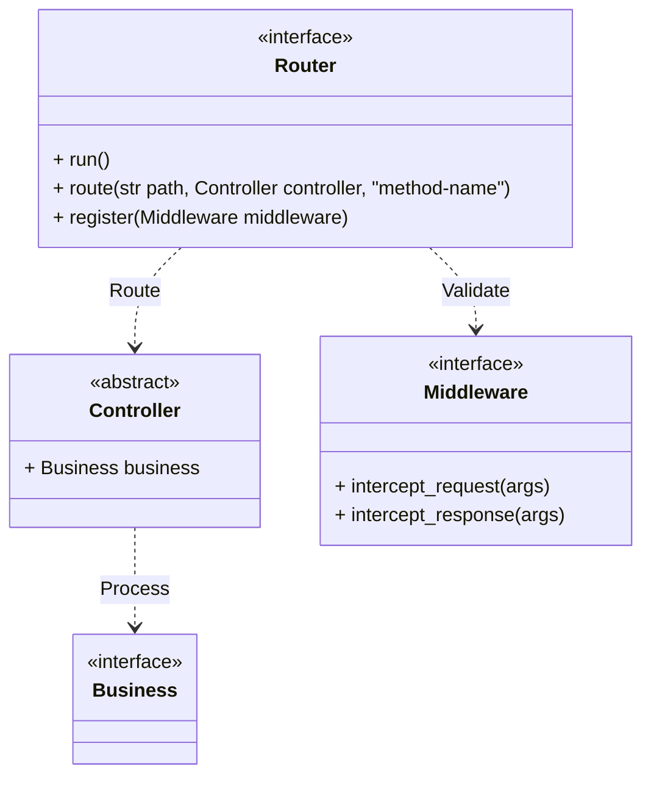
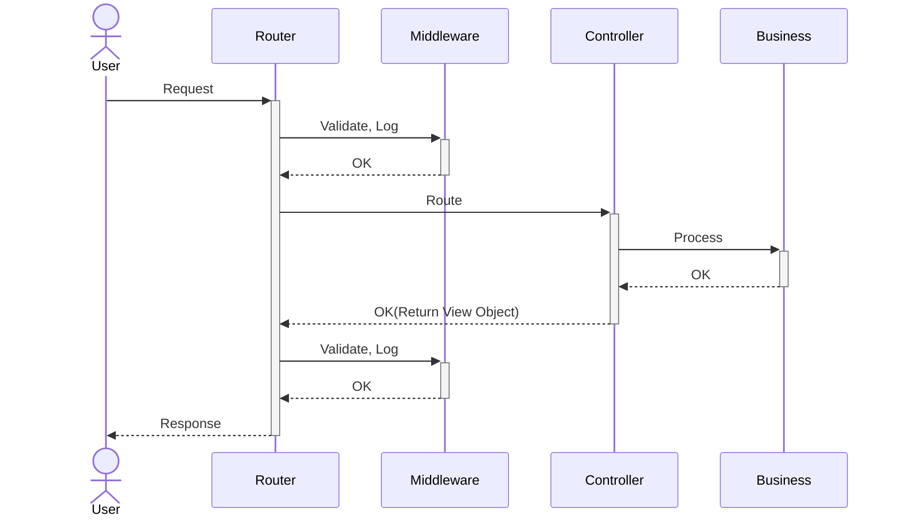

# Module

```mermaid
classDiagram
    class Router {
        <<interface>>
        + run()
        + route(str path, Controller controller, "method-name")
        + register(Middleware middleware)
    }
    class Controller {
        <<abstract>>
        + Business business
    }
    class Middleware {
        <<interface>>
        + intercept_request(args)
        + intercept_response(args)
    }
    class Business {
        <<interface>>
    }
    Router ..> Controller: Route
    Router ..> Middleware: Validate
    Controller ..> Business: Process
```

```mermaid
sequenceDiagram
    actor User
    participant Router
    participant Middleware
    participant Controller
    participant Business

    User ->>+ Router: Request
    Router ->>+ Middleware: Validate, Log
    Middleware -->>- Router: OK
    Router ->>+ Controller: Route
    Controller ->>+ Business: Process
    Business -->>- Controller: OK
    Controller -->>- Router: OK(Return View Object)
    Router ->>+ Middleware: Validate, Log
    Middleware -->>- Router: OK
    Router -->>- User: Response
```
