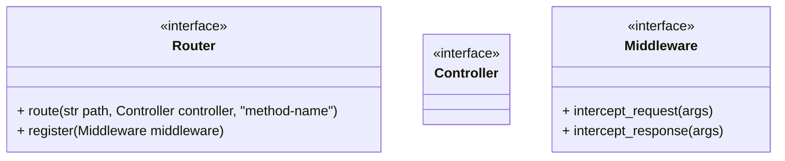

# Module

```mermaid
classDiagram
    class Router {
        <<interface>>
        + route(str path, Controller controller, "method-name")
        + register(Middleware middleware)
    }
    class Controller {
        <<interface>>
    }
    class Middleware {
        <<interface>>
        + intercept_request(args)
        + intercept_response(args)
    }
```
## Detail
